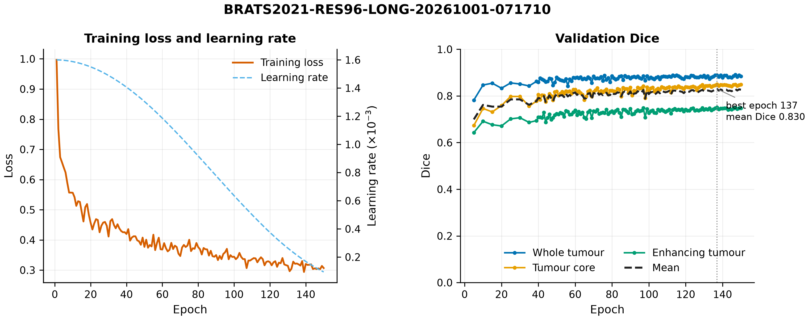
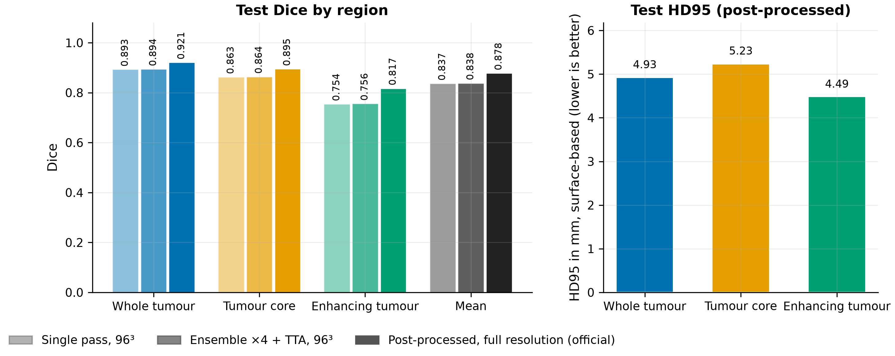
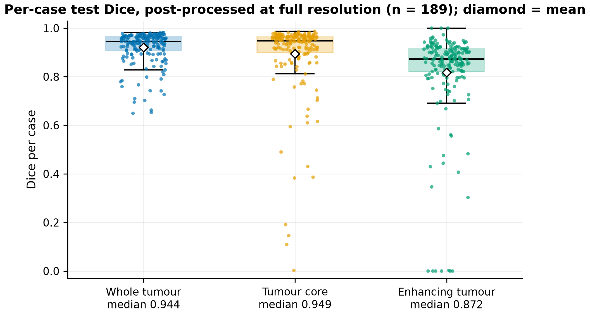
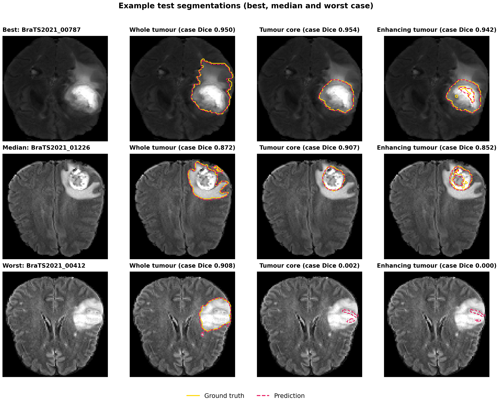

# GLO-NCA Cascade

**GLO-NCA** (Global Context-Aware Neural Cellular Automata) for brain-tumour segmentation
on BraTS: a two-level NCA cascade with channel and spatial global-context blocks and
multi-modal MRI fusion, in about **30,000 parameters**. This repository is the training
package (configs, resumable training, evaluation, figures, CI) and its GCP tooling.

## Results

BraTS 2021: 1,251 glioma cases, seeded random split of 875 training, 187 validation and
189 test patients. Configuration `configs/experiments/brats2021_res96_long.yaml`
(96³ working resolution, augmentation, 150 epochs); best validation epoch 137 (mean Dice 0.830).
The test patients were never used for training, model selection or tuning.

| Test setting (189 patients) | WT Dice | TC Dice | ET Dice | Mean Dice |
|---|---|---|---|---|
| Single pass, 96³ | 0.893 | 0.863 | 0.754 | 0.837 |
| Ensemble ×4 + test-time flips, 96³ | 0.894 | 0.864 | 0.756 | 0.838 |
| **Ensemble ×4 + flips, post-processed, full resolution** | **0.921** | **0.895** | **0.817** | **0.878** |

| Region (post-processed, full resolution) | IoU | HD95 mean (mm) | HD95 median (mm) | Median Dice |
|---|---|---|---|---|
| WT | 0.860 | 4.93 | 2.24 | 0.944 |
| TC | 0.834 | 5.23 | 1.73 | 0.949 |
| ET | 0.723 | 4.49 (184 of 189 cases) | 2.00 | 0.872 |

- The first two rows are scored on the 96³ grid with the v7 Dice formula (an absent region scores 0).
- The last row and the second table come from one evaluation (`evaluate.py --hd95-surface`):
  thresholds WT/TC/ET 0.65/0.65/0.60 and small-lesion clean-up 400/25/400 voxels, both chosen
  on validation; predictions resampled to the original 240×240×155 scans; BraTS scoring, where an
  empty prediction of an absent region scores Dice 1.
- HD95 is the surface-based BraTS/medpy definition in mm; for ET it is undefined in the 5 cases
  where exactly one of the two masks is empty.
- The ensemble passes are stochastic: the training run's own final test of the same setting gave
  0.880 mean Dice (0.921 / 0.896 / 0.823).
- Training: 55.8 h on one NVIDIA L4 (GCP Spot, no preemptions); peak GPU memory 10.4 GB.

| Figure | Content |
|---|---|
| Training curves | training loss, learning rate and validation Dice per epoch |
| Test summary | the three test settings above and the official HD95 |
| Per-case Dice | every test patient, post-processed at full resolution |
| Example segmentations | best, median and worst test patient on the 96³ grid (ensemble ×4 + flips) |






## Model

| | |
|---|---|
| Cascade | 2 NCA levels, coarse then fine (48³ → 96³ for the results above; 32×32×24 → 64×64×48 in v7) |
| NCA cell | 24 channels, hidden 128, 20 + 20 steps, fire rate 0.6, dropout 0.1, kernels 7 / 3 |
| Global context | squeeze-and-excitation (channel) + spatial global-context block in every cell |
| Fusion | T1, T1ce, T2 and FLAIR stacked as input channels; coarse features fused into the fine level |
| Data | foreground crop, cubic resize, nonzero z-norm, ET-biased patches, optional augmentation |
| Loss | focal Tversky + BCE (β 0.75, γ 1.33, CE weight 0.5), optional per-region weights |
| Optimiser | AdamW, LR 1.6e-3 → 1e-5 per-step cosine, element-wise gradient clip ±1 |
| Weights | EMA 0.999; the best validation epoch is kept as `best.pth` |

The base configs reproduce the original Kaggle v7 script exactly (`legacy/kaggle/kaggle_v7.py`);
`tests/test_equivalence.py` runs both and compares losses, validation and test metrics.
The results above use `configs/experiments/brats2021_res96_long.yaml`.

## Layout

```
train.py                  command-line entry point (new run, resume, planned pause)
evaluate.py               re-score a run or an ensemble of runs (resumable)
make_figures.py           redraw a finished run's figures (no GPU needed)
configs/                  base recipes; configs/experiments/ inherit and extend them
glo_nca/                  training package
  config.py               YAML to settings
  data.py                 BraTS dataset (crop, resize, cache, patches, augmentation), split
  evaluation.py           Dice / IoU / HD95, threshold tuning, full-resolution scoring
  trainer.py              training loop, best-model selection, early stopping, final test
  checkpoint.py           full checkpoints for exact resume
  reporting.py            final table, results JSON, per-case CSV
  plots.py                publication figures (PNG 300 dpi + PDF)
src/                      GLO-NCA library (Med-NCA / M3D-NCA lineage)
  agents/                 cascade agent: coarse-to-fine inference and joint training
  models/                 GLO-NCA cell with SE and global-context blocks
  losses/                 focal Tversky + BCE loss
  utils/                  experiment state and metrics
legacy/kaggle/            the original Kaggle scripts (v4-v7)
tests/                    option checks, v7 equivalence test, synthetic data generator
docker/                   training image
cloud/                    GCP scripts and systemd units
docs/figures/             figures of the reported run
.github/workflows/        CI: tests on every push, v7 equivalence weekly
```

## Train locally

```bash
pip install -r requirements.txt     # install torch first from the CUDA index
python train.py --config configs/experiments/brats2021_res96_long.yaml --data-root /path/to/BraTS2021
python train.py --resume experiments/<run-id> --data-root /path/to/BraTS2021
python train.py --config configs/glo_nca_cascade.yaml --data-root /path/to/BraTS --stop-after-epoch 10
```

Each run writes to `experiments/<run-id>/`: `config.yaml`, `split.json`, `train.log`,
`history.csv`, `status.json`, `last.pth` (every epoch, for resume) and `best.pth`
(EMA weights of the best epoch). The final test adds `results.json`, `test_per_case.csv`
and `figures/` (training curves, test summary, per-case Dice, example segmentations).

## Configuration options

All are off by default, so the base configs reproduce the v7 recipe; experiment configs
switch them on through `base:` inheritance, and `--override section.key=value` sets any value.

| Setting | Effect |
|---|---|
| `model.input_size` | working resolution, e.g. `[[48,48,48],[96,96,96]]` |
| `data.augment` | training-only flips, in-plane 90-degree rotations and intensity jitter |
| `data.cache` | `memory`, `disk` (low RAM, shared by workers) or `none` |
| `loss.tversky_beta`, `loss.region_weights` | recall/precision balance and loss weight per region |
| `training.val_every` | validate every N epochs (always on the last and the pause epoch) |
| `training.early_stop_patience`, `early_stop_min_delta` | stop when validation stops improving |
| `evaluation.tune_thresholds` | per-region threshold and clean-up size, chosen on validation |
| `evaluation.full_resolution` | score in the original scan space |
| `evaluation.brats_empty` | BraTS scoring of absent regions |
| `experiment.split_seed` | fixed split, so runs with other seeds can be ensembled |

## Evaluate and ensemble

```bash
python evaluate.py --run experiments/<run-id> --data-root /path/to/BraTS2021 \
    --tune-thresholds --full-resolution --brats-empty
python evaluate.py --run experiments/<run-id> --data-root /path/to/BraTS2021 --splits test \
    --full-resolution --brats-empty --hd95-surface --thresholds WT=0.65,TC=0.65,ET=0.6
python evaluate.py --run experiments/<run-a> --run experiments/<run-b> --run experiments/<run-c> \
    --data-root /path/to/BraTS2021 --tune-thresholds --full-resolution
```

Without tuning, cases are scored one at a time into a progress file, so an interrupted
evaluation resumes where it stopped. Ensemble members must share `split.json` and the
working resolution.

## Train on GCP

Copy `cloud/config/gcp.env.example` to `cloud/config/gcp.env` and fill it in, then:

```bash
./cloud/scripts/start_vm.sh                      # from your machine
./cloud/scripts/setup_gcp.sh                     # on the VM: checkout and image build
./cloud/scripts/run_training.sh --config configs/experiments/brats2021_res96_long.yaml \
    --data-root /data/brats2021 --auto-stop --keep-alive
./cloud/scripts/status.sh                        # progress
./cloud/scripts/watchdog.sh                      # from your machine: restart after Spot preemptions
```

Runs are synced to `gs://<bucket>/experiments/<run-id>/` every 5 minutes. With
`--keep-alive` a restarted VM resumes the run from its last epoch; `watchdog.sh` restarts
the VM only after a preemption, and `--auto-stop` powers it off when the run ends.

## Verify

```bash
python tests/test_options.py                                   # unit checks, no data needed
python tests/make_synthetic_data.py /tmp/syn --cases 12         # synthetic BraTS-style cases
python tests/test_equivalence.py /tmp/syn                       # identical to the Kaggle v7 script
```

## Credits

Built on the Med-NCA / M3D-NCA framework by John Kalkhof et al. (MIT). See `LICENSE`.
